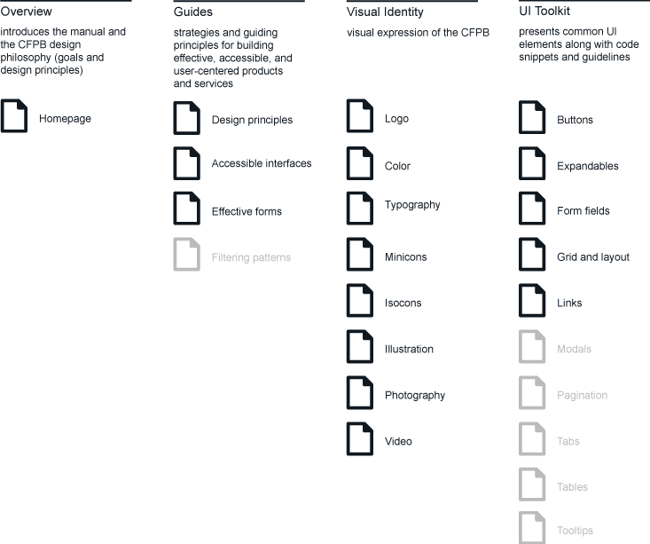

# The CFPB Design Manual

https://cfpb.github.io/design-manual/

This is the repository for CFPB's Design Manual for developing
print and web products.
It contains both the assets and the content for the site.

This Design Manual is an open-source resource for CFPB staff to produce
effective and visually-consistent products that are easy for consumers
to access, use, and understand.
The Manual includes our design principles, guidelines for user experience,
visual identity standards, and code snippets for common user interface elements.
The Manual will continue to evolve as we learn what works best
for the CFPB and the people we serve.

These standards reflect our latest thinking and are just beginning to be
incorporated into the CFPB's most recent projects.
See them in practice in
[eRegs](http://www.consumerfinance.gov/eregulations/),
[Consumer Response](http://www.consumerfinance.gov/complaint/), and
[Owning a Home](http://www.consumerfinance.gov/owning-a-home/).

We are proud to join the community of organizations that have made their
design standards public, such as
[Mozilla](http://www.mozilla.org/en-US/styleguide/),
[BBC](http://www.bbc.co.uk/gel), and the UK's
[Government Digital Service](https://www.gov.uk/service-manual).
We hope our design manual can serve as a foundation for discussing and
practicing user-centered design in government.

All content has been released as open source under the
CC0 1.0 Universal Public Domain Dedication, and we'd love for other agencies,
developers, or groups to adapt it for their own use.


## Running it locally

Content editors and developers probably want to set up the Design Manual on
their local machine so they can preview updates without pushing to GitHub.

Before you get started make sure you have an up-to-date version of Ruby and Bundler.
We use [Homebrew](http://brew.sh/):

```sh
brew install ruby
gem install bundler
```

As the site is intended to be deployed on GitHub Pages, installing the
GitHub Pages gem is the best way to install Jekyll and related dependencies.
Run the following command to install it:

```sh
bundle install
```

[Fork and clone the repo](https://help.github.com/articles/fork-a-repo/)
to your local machine.

From the project directory, run Jekyll:

```sh
bundle exec jekyll serve --watch --baseurl ''
```

Open it up in your browser: <http://localhost:4000/>


## Working with the front end

The Design Manual front end currently uses the following:

- [Grunt](http://gruntjs.com/): Task runner for pulling in assets,
  linting and concatenating code, etc.
- [Bower](http://bower.io/): Package manager for front-end dependencies.
- [Less](http://lesscss.org/): CSS pre-processor.
- [Capital Framework](https://cfpb.github.io/capital-framework/):
  User interface pattern-library produced by the CFPB.
- [Jekyll](http://jekyllrb.com/): Static site generator used by GitHub Pages.

**NOTE:** If you're new to Capital Framework, we encourage you to
[start here](https://cfpb.github.io/capital-framework/getting-started).

### Installing dependencies (one time)

1. Install [node.js](http://nodejs.org/) however you'd like.
2. Install [Grunt](http://gruntjs.com/) and [Bower](http://bower.io/) globally:

```sh
npm install -g grunt-cli bower
```

### Developing

When first setting up this project, and each time you fetch from upstream,
run the setup shell script to install the newest project dependencies and
build the website with grunt:

```sh
./setup.sh
```

We use [Grunt](http://gruntjs.com/) to compile and compress
our Less and JavaScript files.
The easiest way to do that is to run the `watch` task.
This will watch for changes and run `grunt` whenever you save a CSS or JS file:

```
grunt watch
```


## _config.yml

Options within the `_config.yml` file allow you to control the site's title,
subtitle, logo, author information, and the left column navigation.

### Project Page URL Structure

_This is an excerpt from the
[Jekyll docs](http://jekyllrb.com/docs/github-pages/)
on configuring your URL for Project Pages._

Sometimes it's nice to preview your Jekyll site before you
push your `gh-pages` branch to GitHub.
However, the subdirectory-like URL structure GitHub uses for Project Pages
complicates the proper resolution of URLs.
Here is an approach to utilizing the GitHub Project Page URL structure
(`username.github.io/project-name/`) whilst maintaining
the ability to preview your Jekyll site locally.

1. In `_config.yml`, set the `baseurl` option to `/project-name`
   – note the leading slash and the **absence** of a trailing slash.
2. When referencing JS or CSS files, do it like this:
   `{{ site.baseurl }}/path/to/css.css` – note the slash immediately following
   the variable (just before "path").
3. When doing permalinks or internal links, do it like this:
   `{{ site.baseurl }}{{ post.url }}` – note that there is **no** slash
   between the two variables.
4. Finally, if you'd like to preview your site before committing/deploying
   using `jekyll serve`, be sure to pass an **empty string** to the `--baseurl`
   option, so that you can view everything at `localhost:4000` normally
   (without `/project-name` at the beginning): `jekyll serve --baseurl ''`

This way you can preview your site locally from the site root on localhost,
but when GitHub generates your pages from the gh-pages branch all the URLs
will start with `/project-name` and resolve properly.


## Getting involved

We welcome your feedback and contributions.
See the [contribution guidelines](CONTRIBUTING.md) for more details.

**Note:** Currently this file has standard language geared toward code contributions.
Interested in contributing to design discussions? Just check out the
[issues](https://github.com/cfpb/design-manual/issues) and dive right in!

Additionally, you may want to consider
[contributing to the Capital Framework](https://cfpb.github.io/capital-framework/contributing/),
which is the front-end pattern library used in this project.


## Current Sitemap




## Roadmap

In the near future we plan to add guidelines for pagination, filtering, modals,
tooltips, tabs, and responsive tables.
We also plan to make the Manual itself fully responsive for small screens.

---

## How to track an issue

The CFPB’s  Design & Development Team uses GitHub issues to track potential updates and additions to the CFPB Design Manual. These issues are organized through milestones and labels. We welcome the public to participate  in our discussions and in opening pull requests to the Design Manual.

- Updates and additions are published in the Design Manual after a GitHub issue has received approval from the applicable disciplines. The approvers are:
  - Natalia Fitzgerald (GD)
  - Ben Guhin (UX)
  - Scott Cranfill (FEWD)
  - Jennifer Horan (508)
- After an issue has received the necessary approvals, anyone can volunteer to submit a pull request to make the change to the manual. Any applicable changes to our asset libraries and templates should also be updated on CFPB’s internal Google Drive. Any changes that require updates to a Capital Framework component should be made in the appropriate [GitHub repository](https://github.com/cfpb/capital-framework).

### Milestones

#### Backlog
There are three backlogs; Design, UI, FEWD. Every month items are chosen to work through from those backlogs.

#### Sprints
We work through open issues in monthly sprints. These milestone helps us prioritize what to tackle and when. Every month, we have a working session to review open issues and set the next month’s sprint. If you want certain issues included in the next month’s sprint, make sure to communicate this before or during the working session.

#### Second Level
These issues may not be as high of a priority as the monthly sprint but they are issues being actively discussed and worked on. We consider these items to be “next in line.”

### Labels

#### Step one: Label by classification
- 508
- FEWD
- UI
- Design
- Multimedia
- Content strategy

#### Step two: Where is it within the process?

**0 - Backlog** – items within the Design Backlog, the UI Backlog, and the FEWD Backlog.

**1 - Working** – issues that are currently a work in progress.

**2 - Approval** – issues that need approval to publish. Be sure to tag the appropriate approver from the options listed below. To receive approval, the content should be presented in the way that it would be published to the Design Manual.
- FEWD approval
- UI approval
- Design approval
- 508 approval
It is the responsibility of the approver to remove the approval tag.

We recommend adding the following checklist to an issue when it's time to publish:

>Steps to close out this issue:
- [ ] Add to the Design Manual
- [ ] Update Capital Framework
- [ ] Update .ai template(s) to reflect new standard


**3 - Publish** – When an issue has received all of the necessary approvals (which depends on the type of standard), move the issue to the milestone for ‘Publish.’ Be sure to tag how they need to be published from the options listed below.
- Minicon font - All new minicons must have design approval before they are added to the minicon font. Once approved, an SVG file should be emailed to Daniel Pizarro. Updates to the minicon font are released every month or in an as needed basis. The updated file will be provided in a TrueType format (`.ttf`).
- Add to asset library – This is the responsibility of the designer or UX designer that volunteers for the issue. The final asset should either be added to the library or the template available on CFPB’s Google Drive. Examples of assets include the illustration library, isocon library, minicon font, cf.gov web templates, or print suite templates. Changes to the minicon font must go through Daniel Pizarro, are released in batches, and require more lead time.
- Content update – Basic content update that can be done by anyone on the team.
- FEWD task – Content that needs to be added to the Design Manual by a front end web developer. For the new content to be properly demonstrated in the manual, a CF component may be required.

#### Other

**discussion** - topics up for discussion. These are not technically considered active but you might want to solicit thoughts and discussion from the Design and Development team as a whole.

**the manual itself** - actual strategies and updates for the manual.


----

## Open source licensing info
1. [TERMS](TERMS.md)
2. [LICENSE](LICENSE)
3. [CFPB Source Code Policy](https://github.com/cfpb/source-code-policy/)
