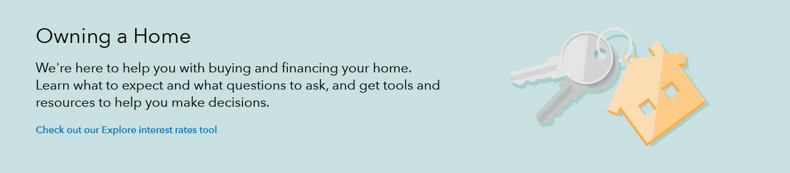

- [Use cases](#use)
- [Desktop style](#desktop)
- [Tablet style](#tablet)
- [Mobile style](#mobile)
{: class="toc"}

Heroes function as a primary focal point on a page, often used to introduce a collection of pages by combining a brief description of the goals of that section along with a visually impactful graphic.
{: class="lead-in"}

  <h5 class="repo-list-header">Repository</h5>
  <ul class="repo-list">
    <li>
      
    </li>
    <li>
      <a href="https://github.com/cfpb/cf-layout"><h4>cf-layout</h4></a>
      
Heroes in the Capital Framework

    </li>
  </ul>

 

<h2 id="use">Use<a href="https://github.com/cfpb/capital-framework/blob/master/src/cf-layout/src/cf-layout.less#L618-L620">View code </a></h2>

Content should be limited to one or two brief sentences to help the user orient themselves and ensure this page will satisfy their desired goal. Copy should be punchy and grab the user’s attention while reinforcing the brand voice. 

Heroes are integral to the page, and cannot be removed. 

Heroes should be limited to first- (i.e., Consumer Help) or second-level (i.e., Credit & Credit Cards) landing pages. The fewer instances of heroes there are, the more impact they will convey. 

Heroes should be the most prominent thing on the page, and help to establish visual hierarchy of where the page lives within the information architecture.

Heroes can contain calls to action. Rules for button versus links apply in a call to action.

<h2 id="desktop">Style at desktop size<a href="https://github.com/cfpb/capital-framework/blob/master/src/cf-layout/src/cf-layout.less#L618-L620">View code </a></h2>

* Full-width colored background with black text and blue link or button. Standard link and button styles apply. Color contrast of text and links on background must be <a href="{{ site.baseurl }}/identity/typography.html#type-accessibility">508-accessible</a>.
* No breadcrumb should appear in or above the hero
* Total height: 285px
* Text is vertically centered, top and bottom padding should be no less than 45 px

* Text spans seven columns
* Heading: H1, 25 maximum character count (including spaces)
* Subheading: Lead paragraph (Avenir Next Regular, 22px/28px), begins 15px below headline, 185 maximum character count (including spaces)
* Call to action link: Standard link colors in subheading style, appears 30px below subheading
* Call to action button: Blue primary button, appears 30px below the subheading copy

* Illustration area appears on the right of the text
* Illustration is centered within five columns
* Illustration height: 195px

<h2 id="tablet">Style at tablet size<a href="https://github.com/cfpb/capital-framework/blob/master/src/cf-layout/src/cf-layout.less#L618-L620">View code </a></h2>

* Heading: H2
* Subheading: Lead paragraph (Avenir Next Regular, 18px/22px)
* Top and bottom padding: 30px
* Module height is flexible to text height
* Visual is vertically centered

<h2 id="mobile">Style at mobile size<a href="https://github.com/cfpb/capital-framework/blob/master/src/cf-layout/src/cf-layout.less#L618-L620">View code </a></h2>

* Heading: H2
* Subheading: Lead paragraph (Avenir Next Regular, 18px/22px)
* Top and bottom padding: 30px
* Illustration is 30px below copy and spans width (to 15px padding)

