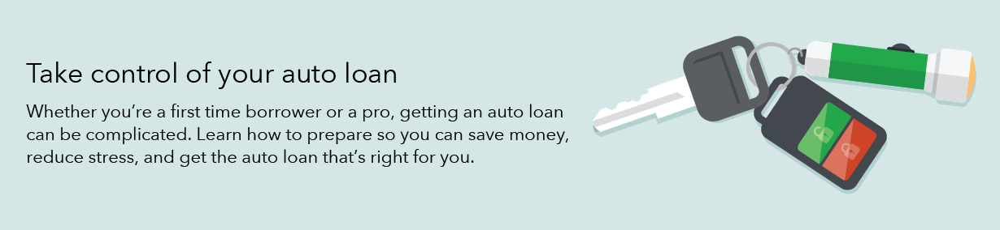
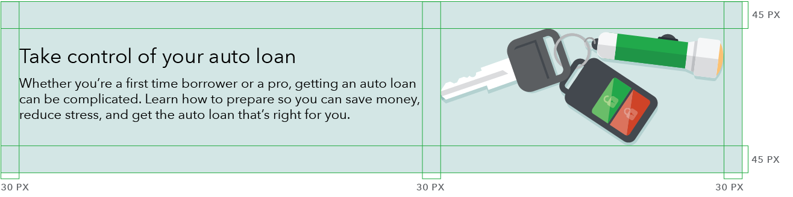
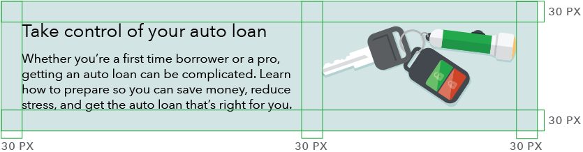
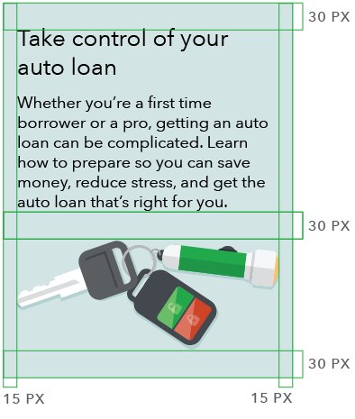
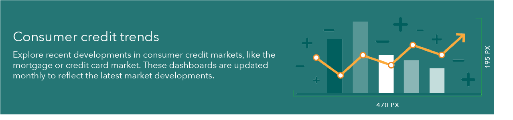
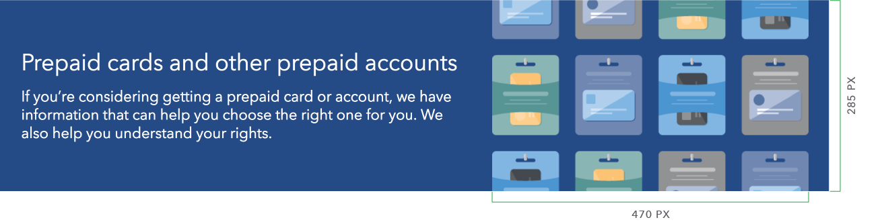
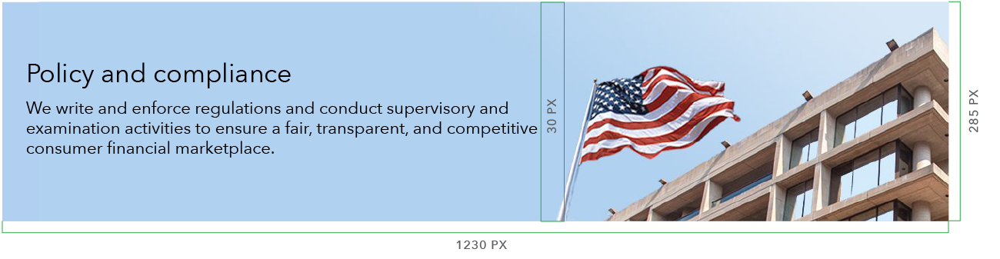

- [Use case](#use-case)
- [Behavior](#behavior)
- [Content guidelines](#content-guidelines)
- [Style](#style)
- [Accessibility](#Accessibility)
 {: class="toc"}

Heroes function as a primary focal point on a page, often used to introduce a collection of pages by combining a brief description of the goals of that section along with a visually impactful graphic.
{: class="lead-in"}

  <h5 class="repo-list-header">Repository</h5>
  <ul class="repo-list">
    <li>
      
    </li>
    <li>
      <a href="https://github.com/cfpb/cf-layout"><h4>cf-layout</h4></a>
      
Heroes in the Capital Framework

    </li>
  </ul>

 

<h2 id="use-case">Use case<a href="https://github.com/cfpb/capital-framework/blob/master/src/cf-layout/src/cf-layout.less#L618-L620">View code </a></h2>

Heroes should be the most prominent element on a page, in terms of their position and visual footprint. Heroes should only be used on top level pages, including landing and sublanding pages.

##### Where to use
[Landing page]({{site.baseurl}}/global-elements/landing-page.html)

[Sub-landing page]({{site.baseurl}}/global-elements/sublanding-page.html)

<h2 id="behavior">Behavior</h2>

Below the 601 px breakpoint, the text and image stack to span the full width of the viewport.

 
<h4>601 px and above</h4> 

 
<h4>600 px and below</h4>

<h2>Content guidelines</h2>
Hero content should serve to orient the user and communicate the primary goal of the page. Copy should be succint and engaging, reflecting the voice and tone of the CFPB. 

 
  <h4>One line heading</h4> 
- Heading: 43 characters (maximum)
- Subheading: 165 characters (minimum) / 185 characters (maximum)

  

 
  <h4>Two line heading</h4>
- Heading: 40 characters (minimum) / 86 characters (maximum)
- Subheading: 25 characters (minimum) / 105 characters (maximum)

  

<h2 id="style">Style<a href="https://github.com/cfpb/capital-framework/blob/master/src/cf-layout/src/cf-layout.less#L618-L620">View code </a></h2>

<h4>901px and above</h4> 
- Heading: H1
- Subheading: Lead paragraph (Avenir Next Regular, 22px/28px)
- Top and bottom padding: 45px
- Total height is 285px (fixed)

 

<h4>Between 900px and 601px</h4>
- Heading: H2
- Subheading: Lead paragraph (Avenir Next Regular, 18px/22px)
- Top and bottom padding: 30px
- Module height is flexible to text height

 

<h4>600px and below</h4>
- Heading: H2
- Subheading: Lead paragraph (Avenir Next Regular, 18px)
- Top and bottom padding: 30px
- Module height is flexible to text height
- Illustration spans full width (less 15px left and right padding)

 

<h3>Image sizing</h3>

<h4>llustration (no bleed)</h4> 
- All illustrations should be saved at double sized to accommodate retina displays
- Both large and small screens: 470px x 195px (940px x 390px)

 
<h4>Illustration (bleed)</h4> 
- Bleeds top and bottom
- All illustrations should be saved at double sized to accommodate retina displays
- Large screens: 470px x 285px (940px x 570px)
- Small screens: 800px x 450px (1600px x 900px) 

<h4>Photo</h4> 
- Large screens: 1290px x 300px
- Small screens: 600px x 338px
- When selecting a photo include a 30px horizontal margin of clear space between text and image

<h2>Accessibility</h2>
- All text must meet WCA (Web Content Accessibility) standards for text [contrast ratio]({{site.baseurl}}/brand-guidelines/typography.html#type-accessibility)
- Use light tint background with black text or secondary color background with white type

