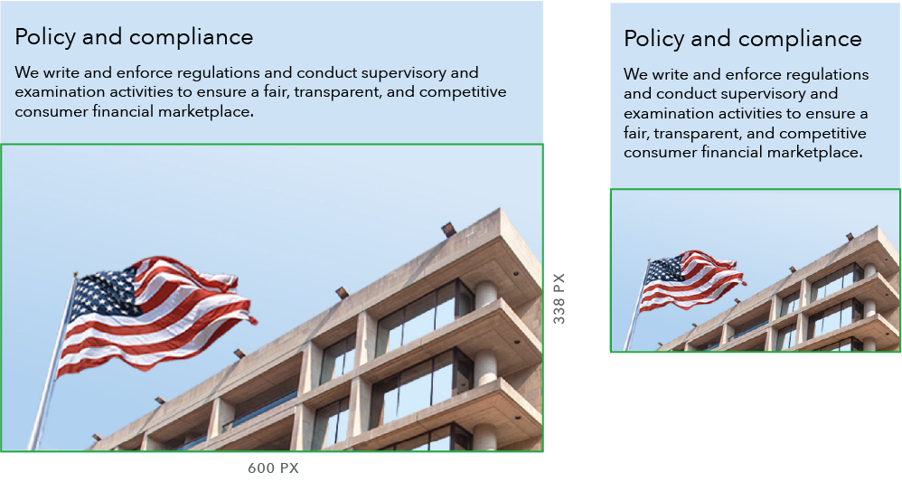
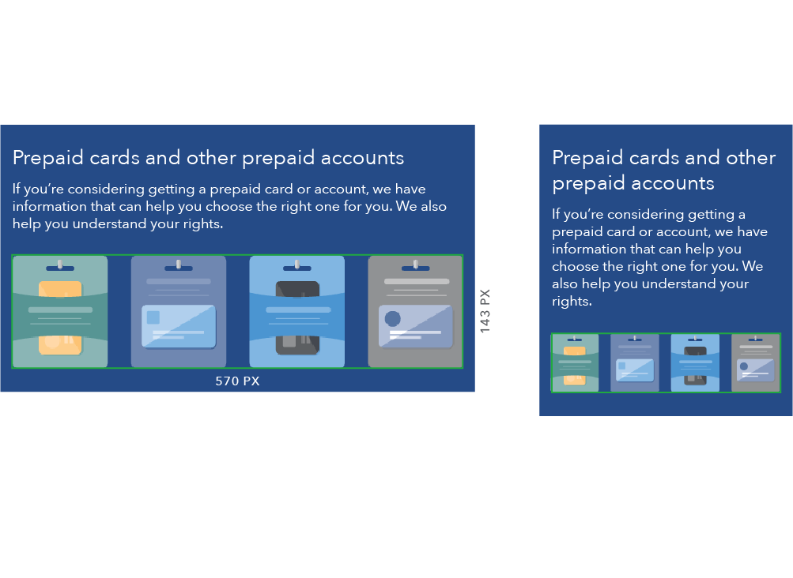

- [Use case](#use-case)
- [Behavior](#behavior)
- [Content guidelines](#content-guidelines)
- [Style](#style)
 {: class="toc"}

Heroes function as a primary focal point on a page, often used to introduce a collection of pages by combining a brief description of the goals of that section along with a visually impactful graphic. 
{: class="lead-in"}

  <h5 class="repo-list-header">Repository</h5>
  <ul class="repo-list">
    <li>
      
    </li>
    <li>
      <a href="https://github.com/cfpb/cf-layout"><h4>cf-layout</h4></a>
      
Heroes in the Capital Framework

    </li>
  </ul>

 

<h2 id="use-case">Use case<a href="https://github.com/cfpb/capital-framework/blob/master/src/cf-layout/src/cf-layout.less#L618-L620">View code </a></h2>

Heroes are the most prominent component on a page, in terms of their position and visual footprint. Heroes should only be used on top level pages, including landing and sublanding pages.

##### Where to use
[Landing page]({{site.baseurl}}/global-elements/landing-page.html)

[Sublanding page]({{site.baseurl}}/global-elements/sublanding-page.html)

<h2 id="behavior">Behavior<a href="https://github.com/cfpb/capital-framework/blob/master/src/cf-layout/src/cf-layout.less#L618-L620">View code </a></h2>

Below the 601 px breakpoint, the text and image stack to span the full width of the viewport.

 
<h4>601 px and above</h4> 

 
<h4>600 px and below</h4>

<h2 id="content-guidelines">Content guidelines<a href="https://github.com/cfpb/capital-framework/blob/master/src/cf-layout/src/cf-layout.less#L618-L620">View code </a></h2>
Hero content should serve to orient the user and communicate the primary goal of the page. Copy should be succint and engaging, reflecting the voice and tone of the CFPB. 

<h3>Purpose</h3>
Hero content should help a user answer these two questions: 

- Is this page what I was looking for? (orient the user)
- Do I want to keep reading? (engage the user)

Since the goal of the hero is to get the user to continue reading the page, don't include links or calls to action within the hero. If there is content that needs to link elsewhere for explanation, place it underneath the hero within the main content area.  

<h3> Parts of the hero</h3>

<h4>Heading</h4> 
Headings should communicate what the user can learn from the page or the benefit the page provides. Headings should be a single phrase, preferably one line at the largest breakpoint (1230px). With two line headings, take care to avoid orphaned text.

- One-line heading: 41 characters maximum (expected behavior is one line at 1230px wide)
- Two-line heading: 82 characters maximum (expected behavior is two lines at 1230px wide)

<h4>Subheading</h4>
Subheading content should be brief, enticing, and build upon the heading to describe the value of the page. Take care to avoid orphaned text.

- Subheading (after one-line heading): Between 165 and 186 characters (expected behavior is three lines at 1230px wide)
- Subheading (after two-line heading): Between 108 and 124 characters (expected behavior is two lines at 1230px wide)

<h2 id="style">Style<a href="https://github.com/cfpb/capital-framework/blob/master/src/cf-layout/src/cf-layout.less#L618-L620">View code </a></h2>

- All illustrations should be saved at 200% to accommodate retina displays
- When saving illustrations, use a transparent background

##### Component parts

[Illustration]({{site.baseurl}}/brand-guidelines/illustration.html)

[Photography]({{site.baseurl}}/brand-guidelines/photography.html)

<h3>Standard hero</h3>

<h4>Illustration (no bleed)</h4>
- Single image for both large and small screens
- Illustration dimensions (maximum): 470px x 195px (2x: 940px x 390px)

 
  
Large screens (601+)

   

 
Small screens (600-)
 
   

<h3>Hero variations</h3>

<h4>Photo</h4>
- Two images must be created, one for large and one for small screens
- Large and small screen images should contain the same elements but can differ compositionally
- When selecting a photo include a 30px horizontal margin of clear space between text and image area
- Type contrast ratios cannot be mathematically determined for photos so special care should be paid when selecting these images
- To conserve vertical space, small screen image should be as short as possible
- Photo dimensions for large screens (exact): 1230px x 285px
- Photo dimensions for small screens: 600px (exact) x 338px (maximum)

 
  
Large screens (601+)

   

 
Small screens (600-)
 
   

<h4>Illustration (bleed)</h4>
- Two images must be created, one for large and one for small screens
- Large and small screen images should contain the same elements but can differ compositionally
- On large screens, illustration bleeds top and bottom
- Large screen image dimensions are based on maximum possible hero height at 601px width
- To conserve vertical space, small screen image should be as short as possible
- Illustration dimensions for large screens (exact): 470px x 638px (2x: 940px x 1276px)
- Illustration dimensions for small screens: 570px (exact) x 320px (maximum) (2x: 1140px x 640px) 

 
  
Large screens (601+)

   

 
Small screens (600-)
 
   

<h3>Style at different breakpoints</h3>

<h4>901px and above</h4> 
- Heading: H1
- Subheading: Avenir Next Regular, 22px/28px
- Top and bottom padding: 45px
- Left and right padding: 30px
- Text is vertically centered
- Total height is 285px (fixed)

 

<h4>Between 900px and 601px</h4>
- Heading: H2
- Subheading: Avenir Next Regular, 18px/22px
- Padding on all sides: 30px
- Module height is flexible to text height

 

<h4>600px and below</h4>
- Heading: H2
- Subheading: Avenir Next Regular, 18px/22px
- Top and bottom padding: 30px
- Left and right padding: 15px
- Module height is flexible to text height

 

